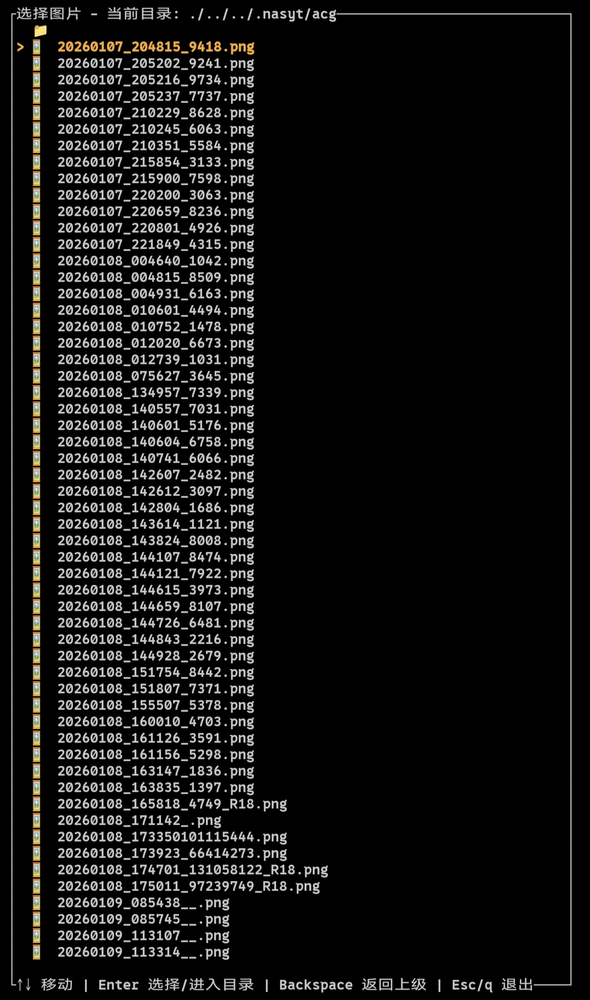

# 🌌 nimg 终端图片查看器

一款基于`Rust`语言的终端图片查看器

使用`ratatui`构建终端界面,`image`库负责图片解码。

利用半块字符（▀）在终端中显示图片，从而获得两倍的垂直分辨率，并支持平滑滚动与缩放。





## 特性

- 自动识别格式 –支持 `PNG、JPEG、WebP、GIF、BMP、TIFF、ICO、AVIF、QOI`等（image 库支持的所有格式）。
- 缩放 – 按 + / - 键放大/缩小，保持图片宽高比。
- 滚动 – 大图可使用方向键滚动查看。
- 文件浏览器 – 无参数运行时自动启动图形化文件选择器，支持目录导航。
- 性能优化 – 使用快速的三角滤波（Triangle）进行缩放，绘制循环高效。
- 真彩色支持 – 在支持 24 位色的现代终端中完美显示。

## 安装

从`crates.io`社区获取资源
```bash
cargo install nimg
```

或手动克隆并编译：
```bash
git clone https://github.com/nasyt233/nimg.git
cd nimg
cargo build --release
./target/release/nimg
```

## 依赖

- `Rust 1.65` 或更高版本
- image 库的底层系统依赖（如 libpng、libjpeg 等）通常 cargo 会自动处理，但某些系统可能需要手动安装：
  - Debian/Ubuntu：sudo apt install libpng-dev libjpeg-dev

## 使用方法

```bash
nimg #图形界面选择查看

#或者

nimg [图片路径] #指定查看的图片路径查看
```

- 如果提供了图片路径，程序直接以查看器模式打开。
- 如果没有提供参数，则启动文件浏览器，可以在目录中选择图片。

## 快捷键

按键 作用
- ← / → / ↑ / ↓ 滚动图片（当图片放大后）
- + / = 放大（步长 1.1 倍）
- - / _ 缩小（步长 1.1 倍）
- q 退出查看器
- Esc / q 在文件浏览器中退出程序
- Enter 在文件浏览器中选择图片 / 进入目录
- Backspace 在文件浏览器中返回上级目录
- ↑ / ↓ 在文件浏览器中上下移动选择

## 工作原理

1. 查看器使用`image`库将图片解码为 RGBA 缓冲区。
2. 然后根据终端大小（或用户设定的缩放比例）对图片进行缩放，再按字符逐个渲染：
3. 每个终端单元格显示两个垂直像素——上半部分用单元格前景色，下半部分用背景色，借助 Unicode 半块字符 ▀ 实现。
4. 因此垂直分辨率是行数的两倍，水平分辨率保持每列一个像素。
5. 滚动和缩放通过重新计算显示区域并重新采样图片来实现。

## 构建

```bash
cargo build --release
```

生成的可执行文件位于 target/release/nimg

## 配置

无需配置文件，程序会自动适应终端尺寸。

## 许可证

本项目采用 MIT 许可证,详见 LICENSE 文件。

## 鸣谢

- [ratatui] – 优秀的终端 UI 框架
- [image] – 强大的图片解码库
- [crossterm] – 跨平台终端操作支持
 
 
 
 
 
 
 
 
 
 

 

 
 
 

 
 

 
 
 
 
 
 
 
